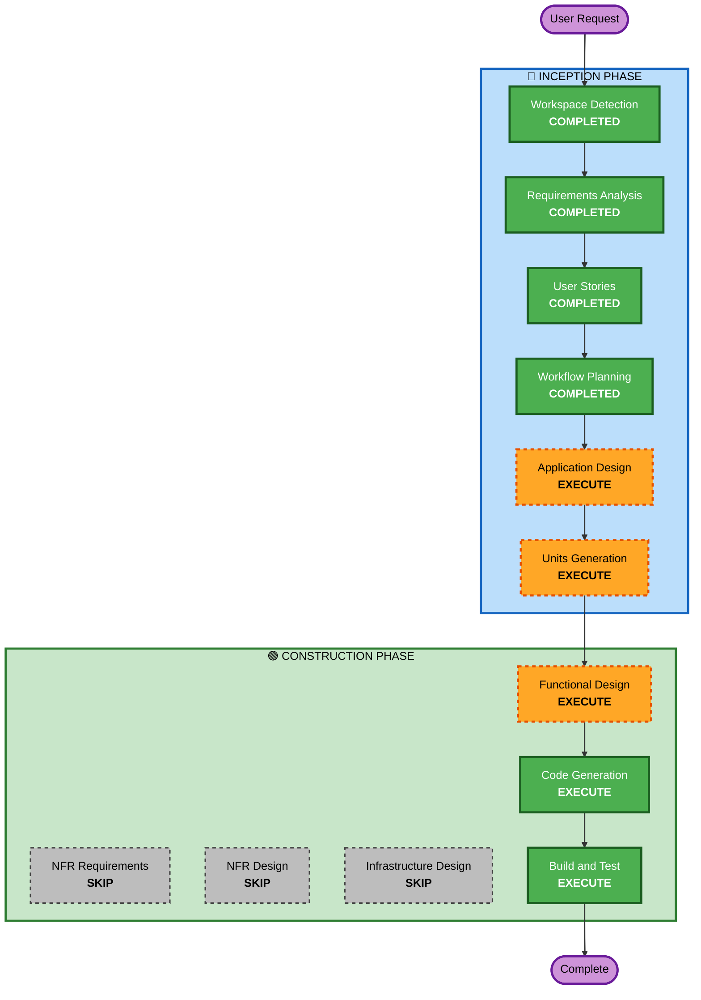

# Execution Plan - 테이블오더 서비스

## Detailed Analysis Summary

### Change Impact Assessment
- **User-facing changes**: Yes — 고객용 주문 UI + 관리자 대시보드 (신규)
- **Structural changes**: Yes — 전체 시스템 신규 구축 (모노레포 4개 패키지)
- **Data model changes**: Yes — 전체 데이터 모델 신규 설계 필요
- **API changes**: Yes — REST API 전체 신규 설계
- **NFR impact**: Yes — SSE 실시간 통신, 세션 관리, 동시 접속

### Risk Assessment
- **Risk Level**: Medium
- **Rollback Complexity**: Easy (신규 프로젝트이므로 롤백 불필요)
- **Testing Complexity**: Moderate (SSE 실시간 통신 테스트 필요)

---

## Workflow Visualization



### Text Alternative
```
Phase 1: INCEPTION
  - Workspace Detection (COMPLETED)
  - Requirements Analysis (COMPLETED)
  - User Stories (COMPLETED)
  - Workflow Planning (COMPLETED)
  - Application Design (EXECUTE)
  - Units Generation (EXECUTE)

Phase 2: CONSTRUCTION
  - Functional Design (EXECUTE, per-unit)
  - NFR Requirements (SKIP)
  - NFR Design (SKIP)
  - Infrastructure Design (SKIP)
  - Code Generation (EXECUTE, per-unit)
  - Build and Test (EXECUTE)
```

---

## Phases to Execute

### 🔵 INCEPTION PHASE
- [x] Workspace Detection (COMPLETED)
- [x] Requirements Analysis (COMPLETED)
- [x] User Stories (COMPLETED)
- [x] Workflow Planning (IN PROGRESS)
- [ ] Application Design - **EXECUTE**
  - **Rationale**: 신규 프로젝트로 컴포넌트 식별, 서비스 레이어 설계, API 엔드포인트 정의 필요
- [ ] Units Generation - **EXECUTE**
  - **Rationale**: 4개 패키지(backend, customer-app, admin-app, shared)로 분해하여 병렬 개발 가능하도록 단위 정의 필요

### 🟢 CONSTRUCTION PHASE
- [ ] Functional Design - **EXECUTE** (per-unit)
  - **Rationale**: 데이터 모델, API 스키마, 비즈니스 로직(세션 관리, 주문 상태 전이) 상세 설계 필요
- [ ] NFR Requirements - **SKIP**
  - **Rationale**: 기술 스택 이미 결정됨, 소규모 MVP로 별도 NFR 분석 불필요, 기본 성능/보안은 요구사항에 포함
- [ ] NFR Design - **SKIP**
  - **Rationale**: NFR Requirements 스킵에 따라 자동 스킵
- [ ] Infrastructure Design - **SKIP**
  - **Rationale**: 배포 환경 미정, Docker Compose 로컬 개발만 필요, 클라우드 인프라 설계 불필요
- [ ] Code Generation - **EXECUTE** (per-unit, ALWAYS)
  - **Rationale**: 실제 코드 구현
- [ ] Build and Test - **EXECUTE** (ALWAYS)
  - **Rationale**: 빌드 및 테스트 지침 생성

### 🟡 OPERATIONS PHASE
- [ ] Operations - PLACEHOLDER

---

## Success Criteria
- **Primary Goal**: 고객이 태블릿에서 메뉴를 보고 주문하고, 관리자가 실시간으로 주문을 모니터링할 수 있는 MVP 완성
- **Key Deliverables**:
  - 동작하는 백엔드 API (Express + TypeScript)
  - 고객용 React 앱 (메뉴 조회, 장바구니, 주문)
  - 관리자용 React 앱 (실시간 대시보드, 테이블/메뉴 관리)
  - Docker Compose 개발 환경
  - 공유 타입 패키지
- **Quality Gates**:
  - 모든 API 엔드포인트 동작 확인
  - SSE 실시간 주문 전달 2초 이내
  - 장바구니 로컬 저장 동작
  - JWT 인증 동작
